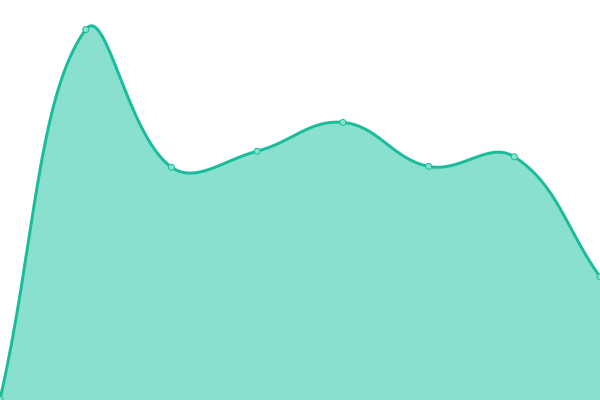

# [📈 Live Status](https://dencap.github.io/Upptime): <!--live status--> **🟩 All systems operational**

This repository contains the uptime monitor and status page for [DENCAP](https://dencap.com).

<!--start: status pages-->
<!-- This summary is generated by Upptime (https://github.com/upptime/upptime) -->
<!-- Do not edit this manually, your changes will be overwritten -->
<!-- prettier-ignore -->
| URL | Status | History | Response Time | Uptime |
| --- | ------ | ------- | ------------- | ------ |
|  [DC Main](https://www.dencap.com) | 🟩 Up | [dc-main.yml](https://github.com/dencap/Upptime/commits/HEAD/history/dc-main.yml) | 

 643ms
     
 | 

<a href="https://dencap.github.io/Upptime/history/dc-main">100.00%</a>
    

|  [DC Payment Portal](https://pay.dencapsecure.com) | 🟩 Up | [dc-payment-portal.yml](https://github.com/dencap/Upptime/commits/HEAD/history/dc-payment-portal.yml) | 

 268ms
     
 | 

<a href="https://dencap.github.io/Upptime/history/dc-payment-portal">99.61%</a>
    

|  [DC Doc Portal-Agent](https://agents.dencapsecure.com) | 🟩 Up | [dc-doc-portal-agent.yml](https://github.com/dencap/Upptime/commits/HEAD/history/dc-doc-portal-agent.yml) | 

 266ms
     
 | 

<a href="https://dencap.github.io/Upptime/history/dc-doc-portal-agent">100.00%</a>
    

|  [DC Doc Portal-Provider](https://providers.dencapsecure.com) | 🟩 Up | [dc-doc-portal-provider.yml](https://github.com/dencap/Upptime/commits/HEAD/history/dc-doc-portal-provider.yml) | 

 232ms
     
 | 

<a href="https://dencap.github.io/Upptime/history/dc-doc-portal-provider">99.80%</a>
    

|  [HMD Main](https://hmidental.com) | 🟩 Up | [hmd-main.yml](https://github.com/dencap/Upptime/commits/HEAD/history/hmd-main.yml) | 

 949ms
     
 | 

<a href="https://dencap.github.io/Upptime/history/hmd-main">99.61%</a>
    

|  [HMD Doc Portal](https://hmdsecure.com) | 🟩 Up | [hmd-doc-portal.yml](https://github.com/dencap/Upptime/commits/HEAD/history/hmd-doc-portal.yml) | 

 385ms
     
 | 

<a href="https://dencap.github.io/Upptime/history/hmd-doc-portal">100.00%</a>
    

<!--end: status pages-->
